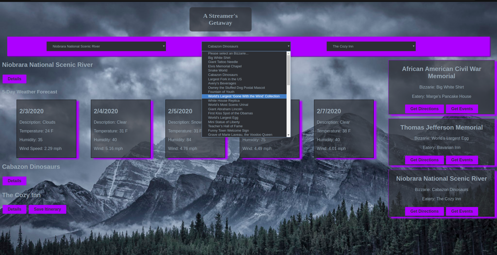

# Holiday Road from Nashville

## Project Description

Holiday Road is an application that will allow people to build itinerares for their trips to the beautiful national parks maintained by the National Park Service. The starting point of each trip will be Nashville, TN, but the destination will be a national park selected by the user.

## How to Use

1. Clone this repository
1. `cd` into the directory it creates
1. `cd` into `api` directory
1. Run `json-server -w db.json -p 3000` in `api` directory
1. In a separate terminal, `cd` into main directory
1. Run local host server

## Personas

We were given instructions to design the app to cater to a certain type of persona. We chose Peter, whose personality profile is shown below.

### Building the Itinerary

* National parks, bizzararies, and eateries are listed in a dropdown. When user chooses one, it displays the name of each in the **Itinerary Preview** section.

* When the user has selected a park, a query is sent to the Open Weather API to display the 5-day forecast for that location.

* A 'details' button is included for more information on each destination.

* When all 3 types of locations are selected, the user is able to save the itinerary.

* After an itinerary is saved, the user is able to click 'Get Directions', which will list detailed instructions from Nashville Software School to the park destination using Graphhopper APIs

## APIs Used

* Graphhopper API
* National Park Service API
* Open Weather API

## Authors

* **Tyler Davis** - (https://github.com/tylerdav)
* **John Gilliam** - (https://github.com/jwgilliam)
* **Willy Metcalf** - (https://github.com/WilliamMetcalf-37)
* **Jansen van der Spuy** - (https://github.com/jansenv)
* **Wes Waters** - (https://github.com/wildwes)